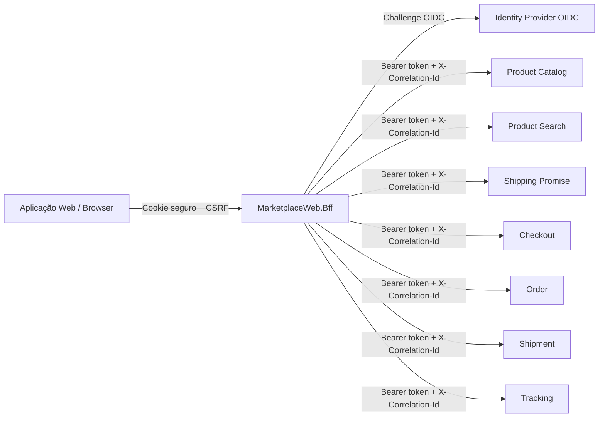

# MarketplaceWeb.Bff

Backend for Frontend (BFF) do canal web do Marketplace. Este microserviço centraliza a experiência da aplicação web, autentica o usuário via OpenID Connect, protege chamadas mutáveis com antiforgery/CSRF, aplica rate limiting por usuário e compõe respostas orientadas à tela consumindo microserviços de domínio como catálogo, frete, checkout, pedidos, expedição e rastreamento.

## Sumário

- [Visão geral](#visão-geral)
- [Responsabilidades](#responsabilidades)
- [Arquitetura e fluxo](#arquitetura-e-fluxo)
- [Stack técnica](#stack-técnica)
- [Estrutura do projeto](#estrutura-do-projeto)
- [Configuração](#configuração)
- [Como executar localmente](#como-executar-localmente)
- [Autenticação e autorização](#autenticação-e-autorização)
- [Proteção CSRF e idempotência](#proteção-csrf-e-idempotência)
- [Resiliência, cache e rate limiting](#resiliência-cache-e-rate-limiting)
- [Endpoints expostos](#endpoints-expostos)
- [Contratos principais](#contratos-principais)
- [Integrações downstream](#integrações-downstream)
- [Tratamento de erros](#tratamento-de-erros)
- [Observabilidade](#observabilidade)
- [Exemplos de uso](#exemplos-de-uso)
- [Checklist operacional](#checklist-operacional)
- [Evolução recomendada](#evolução-recomendada)

## Visão geral

O `MarketplaceWeb.Bff` é uma API ASP.NET Core 8 que atua como camada intermediária entre o front-end web e os serviços internos do Marketplace. Em vez de expor diretamente vários microserviços ao navegador, o BFF oferece endpoints específicos para as necessidades das páginas web e delega as operações de domínio aos serviços responsáveis.

Principais características:

- API HTTP baseada em Minimal APIs.
- Autenticação por cookie de sessão e desafio via OpenID Connect.
- Propagação de `access_token` para microserviços internos.
- Propagação de `X-Correlation-Id` para rastreabilidade entre serviços.
- Composição de páginas de produto e pedido.
- Cache curto para consulta pública de produto.
- Limitação de taxa por usuário autenticado ou IP.
- Proteção CSRF para operações mutáveis sensíveis.
- Clientes HTTP resilientes com timeout, retry e circuit breaker.
- Respostas de erro padronizadas em `ProblemDetails`.

## Responsabilidades

### O que este BFF faz

- Expõe uma API web versionada em `/api/web/v1`.
- Orquestra chamadas para serviços downstream.
- Ajusta contratos para o consumo do front-end.
- Mantém regras de borda relacionadas à experiência web, como cookies, CSRF, idempotência e composição de payloads.
- Oculta detalhes dos serviços internos e reduz o número de chamadas necessárias pelo navegador.

### O que este BFF não deve fazer

- Persistir dados de domínio de catálogo, pedidos, frete ou pagamento.
- Implementar regras de negócio que pertencem aos microserviços de domínio.
- Substituir validações transacionais dos serviços downstream.
- Expor segredos ou tokens ao cliente web.

## Arquitetura e fluxo



Fluxo típico de página de produto:

1. O front-end chama `GET /api/web/v1/products/{skuId}/page`.
2. O BFF busca o produto no serviço de catálogo.
3. Se `zipCode` for informado, calcula a promessa de frete no serviço de shipping promise.
4. O BFF devolve um payload consolidado com produto, frete opcional e avisos.

Fluxo típico de busca de produtos:

1. O front-end chama `GET /api/web/v1/products/search?query={texto}`.
2. O BFF encaminha o texto para o Product Search Service.
3. O BFF devolve a lista de produtos encontrados no formato orientado ao front-end.

Fluxo típico de página de pedido:

1. O front-end chama `GET /api/web/v1/orders/{orderId}`.
2. O BFF busca o pedido no serviço de pedidos.
3. Quando o pedido possui `ShipmentId`, o BFF busca expedição e rastreamento em paralelo.
4. Falhas parciais de expedição/rastreamento não derrubam toda a página; são convertidas em avisos.

## Stack técnica

- **.NET 8 / ASP.NET Core**: runtime web e Minimal APIs.
- **OpenID Connect + Cookie Authentication**: autenticação do usuário web.
- **Swashbuckle**: Swagger/OpenAPI em ambiente de desenvolvimento.
- **Microsoft.Extensions.Http.Resilience**: timeouts, retry e circuit breaker para `HttpClient`.
- **Antiforgery ASP.NET Core**: proteção CSRF com header `X-CSRF-TOKEN`.
- **Output Cache ASP.NET Core**: cache de curto prazo para produto público.
- **Rate Limiting ASP.NET Core**: token bucket por usuário/IP.

## Estrutura do projeto

```text
.
├── Api/                         # Mapeamento dos endpoints HTTP do BFF
├── Application/                 # Composição de respostas orientadas à tela
│   └── Models/                  # Modelos de resposta compostos para o front-end
├── Clients/                     # Clientes HTTP e DTOs dos serviços downstream
├── Contracts/                   # Contratos de entrada/saída próprios do BFF
├── Infrastructure/              # Handlers, filtros e tratamento global de exceções
├── Properties/launchSettings.json
├── Program.cs                   # Bootstrap, DI, middlewares e configuração da aplicação
├── appsettings.json             # Configuração base
├── appsettings.Development.json # Configuração local de desenvolvimento
├── MarketplaceWeb.Bff.csproj
└── MarketplaceWeb.Bff.http      # Exemplos de chamadas HTTP
```

## Configuração

As configurações principais ficam em `appsettings.json` e podem ser sobrescritas por variáveis de ambiente, secret manager, configurações do orquestrador ou arquivos por ambiente.

### Autenticação

| Chave | Descrição | Exemplo |
| --- | --- | --- |
| `Authentication:Authority` | URL do provedor OIDC. | `https://identity.marketplace.local` |
| `Authentication:ClientId` | Client ID do BFF no provedor de identidade. | `marketplace-web-bff` |
| `Authentication:ClientSecret` | Client secret do BFF. Deve vir de cofre/secret manager. | `__FROM_SECRET_MANAGER__` |

### Serviços downstream

| Chave | Serviço | Exemplo padrão |
| --- | --- | --- |
| `Services:ProductCatalog` | Catálogo de produtos. | `http://product-catalog-service` |
| `Services:ProductSearch` | Busca textual de produtos. | `http://product-search-service` |
| `Services:ShippingPromise` | Cálculo/promessa de frete. | `http://shipping-promise-service` |
| `Services:Checkout` | Checkout. | `http://checkout-service` |
| `Services:Order` | Pedidos. | `http://order-service` |
| `Services:Shipment` | Expedição. | `http://shipment-service` |
| `Services:Tracking` | Rastreamento. | `http://tracking-service` |

### Exemplo com variáveis de ambiente

No ASP.NET Core, `:` pode ser representado por `__` em variáveis de ambiente:

```bash
export Authentication__Authority="https://identity.local"
export Authentication__ClientId="marketplace-web-bff"
export Authentication__ClientSecret="valor-secreto"
export Services__ProductCatalog="http://localhost:5101"
export Services__ProductSearch="http://localhost:5107"
export Services__ShippingPromise="http://localhost:5102"
export Services__Checkout="http://localhost:5103"
export Services__Order="http://localhost:5104"
export Services__Shipment="http://localhost:5105"
export Services__Tracking="http://localhost:5106"
```

## Como executar localmente

### Pré-requisitos

- SDK .NET 8 instalado.
- Serviços downstream disponíveis ou mocks/stubs compatíveis com os contratos esperados.
- Provedor OIDC configurado para o client `marketplace-web-bff`.

### Restaurar, compilar e executar

```bash
dotnet restore
dotnet build
dotnet run --project MarketplaceWeb.Bff.csproj
```

Em ambiente de desenvolvimento, o Swagger fica disponível porque a aplicação habilita `UseSwagger()` e `UseSwaggerUI()` quando `ASPNETCORE_ENVIRONMENT=Development`.

### Arquivo `.http`

O arquivo `MarketplaceWeb.Bff.http` contém exemplos de chamadas para página de produto, pedido, rastreamento e etiqueta de expedição. Ajuste os GUIDs, host e credenciais conforme o ambiente.

## Autenticação e autorização

A aplicação usa autenticação por cookie como esquema padrão e OpenID Connect como desafio. Após autenticação, os tokens são salvos para que o BFF consiga propagar o `access_token` nas chamadas aos serviços internos.

Configurações relevantes:

- Cookie de sessão: `__Host-marketplace-bff`.
- Cookie `HttpOnly` para reduzir exposição a JavaScript.
- `SecurePolicy.Always`, exigindo HTTPS.
- `SameSite=Lax` para o cookie de autenticação.
- Fluxo OIDC Authorization Code com PKCE.
- Escopos solicitados: `openid`, `profile` e `marketplace-api`.

Endpoints protegidos com `RequireAuthorization()` exigem usuário autenticado. Endpoints sem autorização explícita ainda podem receber identidade se o usuário já estiver autenticado, mas não exigem login.

## Proteção CSRF e idempotência

### CSRF

A aplicação registra antiforgery com:

- Header esperado: `X-CSRF-TOKEN`.
- Cookie CSRF: `__Host-marketplace-csrf`.
- `SecurePolicy.Always`.
- `SameSite=Strict`.

Para obter um token CSRF:

```http
GET /bff/csrf
```

O endpoint exige autenticação e retorna um JSON com o token da requisição. Operações mutáveis protegidas devem enviar esse valor no header `X-CSRF-TOKEN`.

### Idempotência

Operações que criam, confirmam ou cancelam recursos exigem o header:

```http
Idempotency-Key: <uuid-ou-chave-unica-da-operação>
```

Quando o header está ausente, o BFF retorna erro de requisição inválida. A chave é propagada aos serviços downstream responsáveis por garantir idempotência transacional.

## Resiliência, cache e rate limiting

### Clientes HTTP resilientes

Todos os clientes downstream são registrados com:

- `BaseAddress` vindo de `Services:<NomeDoServiço>`.
- Timeout específico por serviço.
- Propagação de correlation id.
- Propagação de token de acesso.
- Handler padrão de resiliência com:
  - timeout total;
  - timeout por tentativa;
  - até 2 retries com atraso inicial de 100 ms;
  - circuit breaker com razão de falha de 50%;
  - throughput mínimo de 20 requisições;
  - janela de amostragem de 30 segundos;
  - abertura do circuito por 15 segundos.

Timeouts por tentativa configurados no handler de resiliência. O `HttpClient.Timeout` fica desabilitado para evitar cancelamentos prematuros antes de o pipeline de resiliência aplicar timeout total, retry e circuit breaker.

| Serviço | Timeout por tentativa |
| --- | --- |
| ProductCatalog | 1 segundo |
| ProductSearch | 3 segundos |
| ShippingPromise | 1 segundo |
| Checkout | 2 segundos |
| Order | 1 segundo |
| Shipment | 1 segundo |
| Tracking | 1 segundo |

### Cache

A política `PublicProduct` aplica cache de saída por 30 segundos e varia pelo valor de rota `skuId`. Ela é usada em `GET /api/web/v1/products/{skuId}`.

### Rate limiting

A política `PerUser` usa token bucket com:

- 100 tokens por período.
- Reposição de 100 tokens por minuto.
- Fila de até 10 requisições.
- Chave baseada no claim `sub`; se ausente, usa IP remoto; se ausente, usa `anonymous`.
- Rejeição com HTTP `429 Too Many Requests`.

## Endpoints expostos

### CSRF

| Método | Rota | Auth | CSRF | Descrição |
| --- | --- | --- | --- | --- |
| `GET` | `/bff/csrf` | Sim | Não | Emite token CSRF para operações mutáveis. |

### Produtos

Base: `/api/web/v1/products`

| Método | Rota | Auth | Cache | Descrição |
| --- | --- | --- | --- | --- |
| `GET` | `/{skuId}` | Não obrigatório | `PublicProduct` | Retorna dados do produto a partir do catálogo. |
| `GET` | `/{skuId}/page?quantity=1&zipCode=05726100` | Não obrigatório | Não | Retorna payload composto para página de produto. |

Observações:

- `quantity` é limitado entre `1` e `99`.
- Quando `zipCode` é informado, o BFF tenta calcular frete.
- Falhas no cálculo de frete retornam a página de produto com warning, sem falhar toda a resposta.

### Promessas de frete

Base: `/api/web/v1/shipping-promises`

| Método | Rota | Auth | CSRF | Descrição |
| --- | --- | --- | --- | --- |
| `POST` | `/` | Não obrigatório | Não | Calcula uma promessa de frete diretamente no serviço de shipping promise. |

### Checkout

Base: `/api/web/v1/checkouts`

| Método | Rota | Auth | CSRF | Idempotency-Key | Descrição |
| --- | --- | --- | --- | --- | --- |
| `POST` | `/` | Sim | Sim | Sim | Cria checkout. |
| `GET` | `/{checkoutId}` | Sim | Não | Não | Consulta checkout. |
| `POST` | `/{checkoutId}/confirm` | Sim | Sim | Sim | Confirma checkout. |

### Pedidos

Base: `/api/web/v1/orders`

| Método | Rota | Auth | CSRF | Idempotency-Key | Descrição |
| --- | --- | --- | --- | --- | --- |
| `GET` | `/` | Sim | Não | Não | Lista pedidos do usuário/contexto autenticado. |
| `GET` | `/{orderId}` | Sim | Não | Não | Retorna página composta do pedido. |
| `POST` | `/{orderId}/cancel` | Sim | Sim | Sim | Cancela pedido. |
| `GET` | `/{orderId}/tracking` | Sim | Não | Não | Retorna apenas o rastreamento do pedido, quando disponível. |

### Expedição

Base: `/api/web/v1/shipments`

| Método | Rota | Auth | Resposta | Descrição |
| --- | --- | --- | --- | --- |
| `GET` | `/{shipmentId}/label` | Sim | `application/pdf` | Baixa etiqueta da expedição. |

## Contratos principais

### Criar checkout

```json
{
  "buyerId": "00000000-0000-0000-0000-000000000001",
  "shippingAddress": {
    "zipCode": "05726100",
    "city": "São Paulo",
    "state": "SP",
    "country": "BR"
  },
  "items": [
    {
      "skuId": "00000000-0000-0000-0000-000000000002",
      "quantity": 1
    }
  ],
  "paymentMethodId": "pm_123"
}
```

Resposta esperada:

```json
{
  "checkoutId": "00000000-0000-0000-0000-000000000003",
  "status": "Created",
  "itemsTotal": 100.0,
  "shippingPrice": 10.0,
  "totalAmount": 110.0,
  "currency": "BRL",
  "expiresAt": "2026-06-10T12:00:00Z"
}
```

### Confirmar checkout

```json
{
  "paymentToken": "tok_123",
  "promiseId": "promise_456"
}
```

### Página de produto

```json
{
  "product": {
    "skuId": "00000000-0000-0000-0000-000000000002",
    "sellerId": "00000000-0000-0000-0000-000000000004",
    "title": "Produto exemplo",
    "category": "Categoria",
    "price": 100.0,
    "availableForSale": true
  },
  "shipping": {
    "available": true,
    "promiseId": "promise_456",
    "mode": "Standard",
    "estimatedDeliveryDate": "2026-06-15",
    "cost": 10.0,
    "unavailableReason": null
  },
  "warnings": []
}
```

### Página de pedido

```json
{
  "order": {
    "orderId": "00000000-0000-0000-0000-000000000005",
    "status": "Paid",
    "itemsTotal": 100.0,
    "shippingPrice": 10.0,
    "totalAmount": 110.0,
    "currency": "BRL",
    "createdAt": "2026-06-10T12:00:00Z"
  },
  "shipment": {
    "shipmentId": "00000000-0000-0000-0000-000000000006",
    "status": "InTransit",
    "carrierCode": "CORREIOS",
    "trackingCode": "BR123456789",
    "promisedDeliveryDate": "2026-06-15"
  },
  "tracking": {
    "currentStatus": "InTransit",
    "lastCity": "São Paulo",
    "lastState": "SP",
    "lastUpdate": "2026-06-10T12:00:00Z",
    "estimatedDeliveryDate": "2026-06-15",
    "events": []
  },
  "warnings": []
}
```

## Integrações downstream

| Cliente | Interface | Serviço configurado | Chamadas realizadas |
| --- | --- | --- | --- |
| `ProductCatalogClient` | `IProductCatalogClient` | `ProductCatalog` | `GET /products/{skuId}` |
| `ShippingPromiseClient` | `IShippingPromiseClient` | `ShippingPromise` | `POST /shipping-promises` |
| `CheckoutClient` | `ICheckoutClient` | `Checkout` | `POST /checkouts`, `GET /checkouts/{id}`, `POST /checkouts/{id}/confirm` |
| `OrderClient` | `IOrderClient` | `Order` | `GET /orders`, `GET /orders/{id}`, `POST /orders/{id}/cancel` |
| `ShipmentClient` | `IShipmentClient` | `Shipment` | `GET /shipments/{id}`, `GET /shipments/{id}/label` |
| `TrackingClient` | `ITrackingClient` | `Tracking` | `GET /shipments/{shipmentId}/tracking` |

Todas as chamadas downstream recebem:

- `Authorization: Bearer <access_token>`, quando disponível no contexto autenticado.
- `X-Correlation-Id`, reaproveitando o header de entrada ou o `TraceIdentifier` da requisição.

## Tratamento de erros

O BFF usa um exception handler global que converte exceções em `ProblemDetails`.

Mapeamentos principais:

| Cenário | Status retornado | Título |
| --- | --- | --- |
| `BadHttpRequestException` | `400` | `Invalid request` |
| Downstream `404` | `404` | `Resource not found` |
| Downstream `409` ou `422` | Status original | `Business operation rejected` |
| Outros erros downstream | `503` | `Service temporarily unavailable` |
| Erro inesperado | `500` | `Unexpected error` |

Todas as respostas de erro incluem `traceId` em `extensions`, facilitando correlação com logs.

## Observabilidade

### Correlation ID

O BFF propaga `X-Correlation-Id` para todos os serviços downstream. Se o cliente não informar esse header, a aplicação usa o `TraceIdentifier` do ASP.NET Core ou gera um GUID sem hífens.

Recomendação: gateways, front-end e ferramentas de observabilidade devem preservar e exibir esse identificador.

### Logs

A configuração padrão usa nível `Information` para a aplicação e `Warning` para logs de `Microsoft.AspNetCore`. O handler global registra exceções com a mensagem `BFF request failed` e o `TraceId` da requisição.

### Métricas recomendadas

Embora o projeto não inclua configuração explícita de métricas, recomenda-se instrumentar:

- Latência por endpoint do BFF.
- Taxa de erro por endpoint.
- Taxa de `429` por política de rate limiting.
- Status e latência por serviço downstream.
- Aberturas do circuit breaker.
- Quantidade de warnings em respostas compostas.

## Exemplos de uso

### Obter token CSRF

```http
GET https://localhost:7171/bff/csrf
Accept: application/json
```

### Consultar página de produto

```http
GET https://localhost:7171/api/web/v1/products/00000000-0000-0000-0000-000000000001/page?zipCode=05726100&quantity=1
Accept: application/json
X-Correlation-Id: 7f0c7c8c888d4c198d6b8ef96fa1c001
```

### Criar checkout

```http
POST https://localhost:7171/api/web/v1/checkouts/
Accept: application/json
Content-Type: application/json
X-CSRF-TOKEN: <token-obtido-em-/bff/csrf>
Idempotency-Key: 0ccda6f4-1bea-4c42-8b06-7a2e765a97d7

{
  "buyerId": "00000000-0000-0000-0000-000000000001",
  "shippingAddress": {
    "zipCode": "05726100",
    "city": "São Paulo",
    "state": "SP",
    "country": "BR"
  },
  "items": [
    {
      "skuId": "00000000-0000-0000-0000-000000000002",
      "quantity": 1
    }
  ],
  "paymentMethodId": "pm_123"
}
```

### Cancelar pedido

```http
POST https://localhost:7171/api/web/v1/orders/00000000-0000-0000-0000-000000000005/cancel
Accept: application/json
X-CSRF-TOKEN: <token-obtido-em-/bff/csrf>
Idempotency-Key: 9cf2bbfa-c16b-4c99-9d9f-3f8dc6f6af29
```

### Baixar etiqueta de expedição

```http
GET https://localhost:7171/api/web/v1/shipments/00000000-0000-0000-0000-000000000006/label
Accept: application/pdf
```

## Checklist operacional

Antes de promover para um ambiente:

- [ ] Configurar `Authentication:Authority`, `ClientId` e `ClientSecret` via cofre de segredos.
- [ ] Validar callback/redirect URI do OIDC no provedor de identidade.
- [ ] Configurar URLs reais dos serviços downstream.
- [ ] Garantir HTTPS fim a fim para cookies `__Host-*`.
- [ ] Validar CORS/gateway conforme o domínio do front-end, se aplicável.
- [ ] Validar emissão e envio do token CSRF pelo front-end.
- [ ] Garantir geração de `Idempotency-Key` pelo front-end para operações mutáveis idempotentes.
- [ ] Configurar observabilidade de logs, traces e métricas.
- [ ] Validar limites de rate limiting para o volume esperado.
- [ ] Testar cenários de indisponibilidade parcial dos serviços downstream.

## Evolução recomendada

- Adicionar testes automatizados de endpoints e clientes downstream com mocks HTTP.
- Documentar contratos OpenAPI com exemplos e códigos de resposta explícitos.
- Adicionar health checks para dependências críticas.
- Integrar OpenTelemetry para traces distribuídos, métricas e logs correlacionados.
- Externalizar políticas de timeout/retry/circuit breaker para configuração por ambiente.
- Diferenciar políticas de rate limiting por tipo de operação.
- Adicionar validação explícita de payloads de entrada.
- Avaliar cache distribuído para cenários multi-instância, quando necessário.
